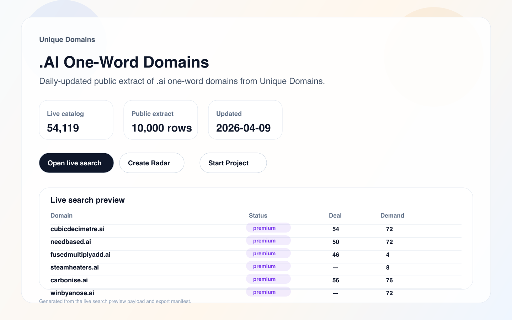
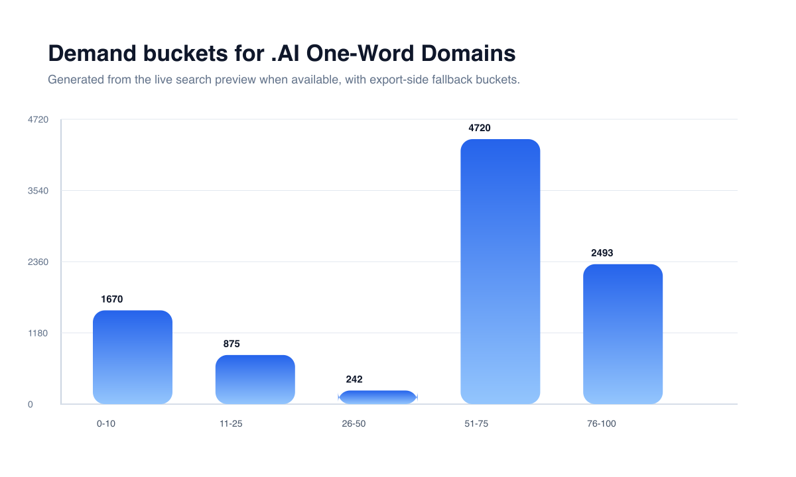

# .AI One-Word Domains (54,119)

<p align="left">
  
  
  
  
  
  
</p>

Daily-updated public extract of .ai one-word domains from Unique Domains.

> **Important:** this repository is a **public 10,000-row extract**, not the full live catalog.
> The full live catalog for this exact search currently contains **54,119 domains** on the canonical page below.

**Last updated:** 2026-04-09  
**Canonical page:** `https://unique.domains/domains/tld/ai`  
**Best for:** founders, investors, studios

[Open live search](https://unique.domains/domains/tld/ai?utm_source=github&utm_medium=referral&utm_campaign=repo_ai_oneword_domains&utm_content=top_open_search) ·
[Create Radar](https://unique.domains/domains/tld/ai?github_intent=radar&utm_source=github&utm_medium=referral&utm_campaign=repo_ai_oneword_domains&utm_content=top_create_radar) ·
[Start Project](https://unique.domains/domains/tld/ai?github_intent=project&utm_source=github&utm_medium=referral&utm_campaign=repo_ai_oneword_domains&utm_content=top_start_project) ·
[Download CSV](./ai.csv) ·
[Download JSON](./ai.json) ·
[Methodology](https://unique.domains/technology?utm_source=github&utm_medium=referral&utm_campaign=repo_ai_oneword_domains&utm_content=top_methodology) ·
[API docs](https://unique.domains/api?utm_source=github&utm_medium=referral&utm_campaign=repo_ai_oneword_domains&utm_content=top_api_docs)



## What This Repository Contains

This repository is the public dataset landing page for the exact search represented by `https://unique.domains/domains/tld/ai`.

- `ai.csv` — public CSV extract (10,000 rows)
- `ai.json` — public JSON extract (10,000 rows)
- `DATA_DICTIONARY.md` — field definitions for the exported files
- `METHODOLOGY.md` — scope, refresh policy, and caveats
- `CHANGELOG.md` — latest snapshot metadata
- `CITATION.cff` — machine-readable dataset citation metadata
- `LICENSE` — terms for the public extract
- `assets/preview-ai-oneword-domains-search.png` — generated preview asset
- `assets/chart-demand-buckets.png` — generated demand-buckets chart

Use this repo to inspect a public sample, download machine-readable files, understand the exported columns, and cite the dataset.

Use the live page to keep the exact search context, review the full live catalog, create a Radar, and turn the search into a Project without rebuilding intent.

## Snapshot Chart



This chart is generated from the same preview payload used to render the README counts and summary.

## Quick Start

```python
import pandas as pd

df = pd.read_csv("https://raw.githubusercontent.com/UniqueDomains/ai-oneword-domains/main/ai.csv")
print(df.head())
```

## Sample Rows

| domain              | status  | attractiveness | demand | length | registrar |
| ------------------- | ------- | -------------- | ------ | ------ | --------- |
| cubicdecimetre.ai   | premium | 54             | 72     | 15     | —         |
| needbased.ai        | premium | 50             | 72     | 10     | —         |
| fusedmultiplyadd.ai | premium | 46             | 4      | 18     | —         |
| steamheaters.ai     | premium | —              | 8      | 13     | —         |
| carbonise.ai        | premium | 56             | 76     | 9      | —         |

## Field Summary

- `Domain` — Fully qualified domain name.
- `Status` — Current acquisition state for the domain in the public extract.
- `Attractiveness` — Composite naming score used as a decision-support signal.
- `Demand` — Relative buyer-pressure score when available.
- `Length` — Character count without the TLD.
- `Registrar` — Registrar name when known.
- `Created` — Creation timestamp when known.
- `Expires` — Expiry timestamp when known.

See [DATA_DICTIONARY.md](./DATA_DICTIONARY.md) for full definitions and types.

## Methodology And Caveats

This repository follows the exact public search represented by the canonical page above.

- Counts, prices, and statuses can change as the live search refreshes.
- Scores are decision-support signals, not guarantees of resale value or fit.
- The live product exposes deeper filters, saved-search workflows, and context continuity beyond this public extract.

See [METHODOLOGY.md](./METHODOLOGY.md) for the full methodology reference.

## Update Policy

- This repository is refreshed regularly from the same export pipeline used for public dataset repos.
- The README count targets the live catalog count from the public landing response when available.
- The CSV and JSON files contain the public extract only and may not match the full live catalog size.
- Stable historical references should be published via GitHub Releases outside this repository snapshot.

See [CHANGELOG.md](./CHANGELOG.md) for the latest snapshot metadata.

## How To Cite

Suggested citation:

> Unique Domains. *.AI One-Word Domains*. Version 2026-04-09. Public GitHub extract for the exact Unique Domains search represented by this repository.

GitHub citation metadata is available in [CITATION.cff](./CITATION.cff).


## Related Links

- [Live search](https://unique.domains/domains/tld/ai?utm_source=github&utm_medium=referral&utm_campaign=repo_ai_oneword_domains&utm_content=top_open_search)
- [Technology and scoring](https://unique.domains/technology?utm_source=github&utm_medium=referral&utm_campaign=repo_ai_oneword_domains&utm_content=top_methodology)
- [Pricing](https://unique.domains/pricing?utm_source=github&utm_medium=referral&utm_campaign=repo_ai_oneword_domains&utm_content=related_pricing)
- [API docs](https://unique.domains/api?utm_source=github&utm_medium=referral&utm_campaign=repo_ai_oneword_domains&utm_content=top_api_docs)
- [GitHub repository](https://github.com/UniqueDomains/ai-oneword-domains)

## Contact

Questions, corrections, or partnership requests: `hello@unique.domains`
